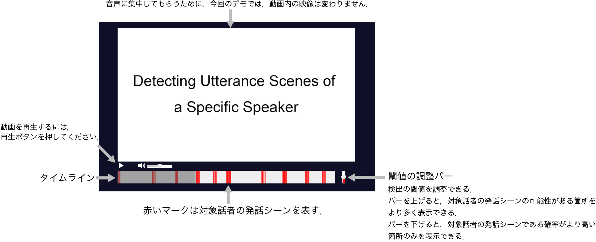
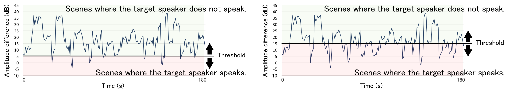

# dla_team25
Deep Learning Advanced

# デモページ
http://dljpdemo.s3-website-ap-northeast-1.amazonaws.com/
## デモページの説明

## 閾値の違いによる検出量の変化
閾値バーを上下すると検出される量が変わるので， 赤いマークの量が変化します．
以下の図は， 閾値の違いによる検出量の変化を図示したものです．

# その他
DNNのコードは以下のリポジトリを参考にしています．
https://github.com/drethage/speech-denoising-wavenet
